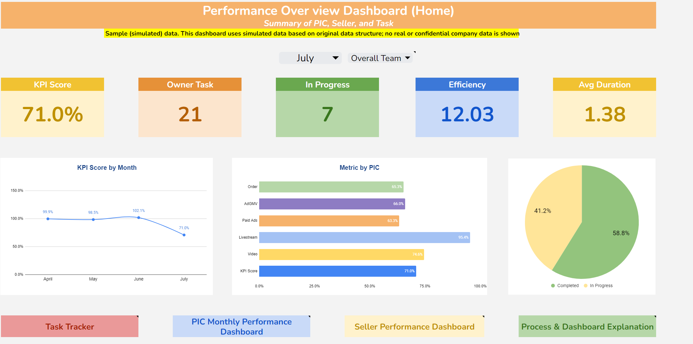
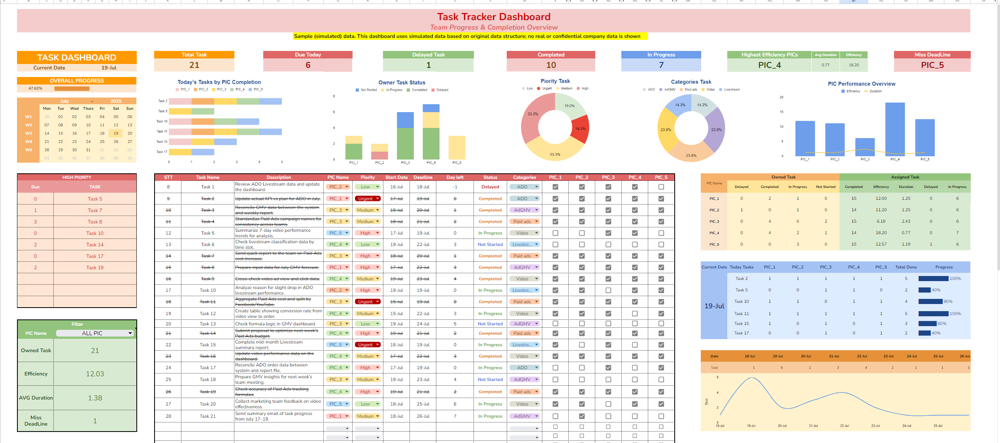
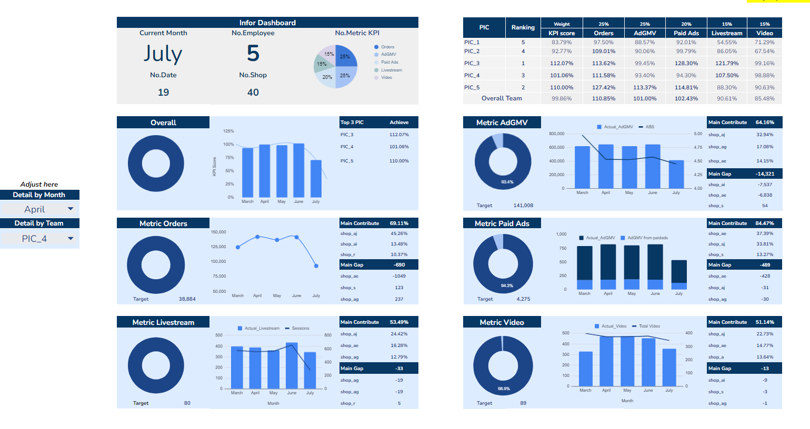
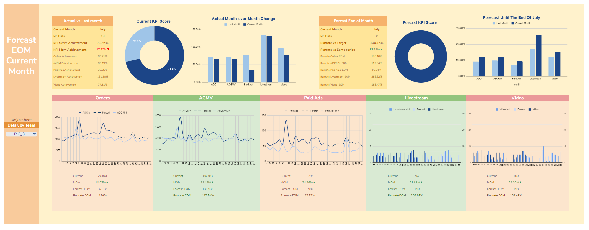
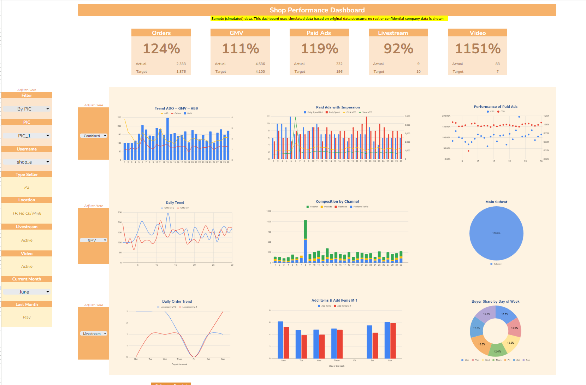

# Team Performance Tracking System – Google Sheets

## 1. **Project Overview**

This project builds a **Performance Tracking System** for a team using Google Sheets, enabling:

- Tracking daily, weekly, and monthly performance of each member and the entire team  
- Monitoring work progress and task status  
- Automatically calculating KPIs and generating summary dashboards  
- Supporting fast and data-driven managerial decision-making  

All data displayed in the dashboard is simulated based on a real-world structure and does not contain any sensitive information.

---

## 2. **Sheet Structure**

### **Sheet 1 – Data Input**

This sheet is used to update KPI performance data on a daily or weekly basis.  

Once the data is updated:

- All dashboard sheets are automatically refreshed through built-in formulas.

---

### **Sheet 2 – Overview Dashboard**

A monthly performance overview dashboard for the entire team.

The dashboard displays:

- Total number of tasks and their execution status  
- KPI Score and Efficiency for the whole team and by individual PIC  
- Work allocation by group / task category  
- Interactive filters by time period and PIC name for flexible performance tracking  

---

### **Sheet 4 – Task Tracking**

The Task Tracker serves as the central hub for managing and monitoring all team tasks on a daily, weekly, and monthly basis.

This sheet combines a detailed task table with a summary dashboard to:

- Track task progress and deadline status  
- Evaluate team and individual PIC performance  
- Analyze workload and completion rates over time  
- Classify tasks by priority level and task group  

---

### **Sheet 5 – Member KPI Performance**

This sheet evaluates performance at both the individual and team levels by month or quarter, while also forecasting KPI achievement by the end of the period.

#### 1. KPI Performance Analysis (Individual & Team)

This section tracks the KPI set including: **Orders, Ad GMV, Paid Ads, Livestream, and Video**.

Users can filter by month, quarter, individual member, or the entire team. Data and charts update automatically.

The dashboard helps to:

- Compare KPI achievement levels between members and the whole team  
- Analyze performance gaps by assigned shop  
- Track trends over the most recent 3 months  

---

#### 2. KPI Performance Forecast

Forecasts the likelihood of KPI achievement by the end of the month based on:

- Current run rate  
- Comparison with the same period and previous month  
- Allocation trend of the remaining days based on the last 3 months  

The forecast results are benchmarked against targets to assess completion probability and detect early risks of underperformance.

---

### Sheet 6 – Shop-Level Performance

This sheet tracks the performance of each shop based on the KPI set of the assigned member.  

The dashboard automatically updates according to the selected shop and member.

**Block 1: Correlation Performance Analysis**
- ADO and GMV  
- Paid Ads and Impressions  
- CPC and CTR  

**Block 2: Revenue & Order Analysis**
- Daily trend  
- Contribution structure  
- Sub-category allocation  

**Block 3: Sales Channel Analysis – Livestream & Video**
- Order trends by channel  
- Add-to-cart performance by channel  
- Conversion performance by day of the week  

---

**FULL FILE** [HERE](https://docs.google.com/spreadsheets/d/1Yenltej4gWU9nJimhRiPbkxyMMUPeSArb9E1LzAAtMI/edit?gid=1802438500#gid=1802438500)

---

## 4. System Value

- Builds a multi-layer performance tracking framework from **Task → Member → Shop**  
- Standardizes KPI measurement across the team  
- Integrates performance tracking and forecasting within a single system  
- Enables data-driven decision-making instead of manual reporting  
